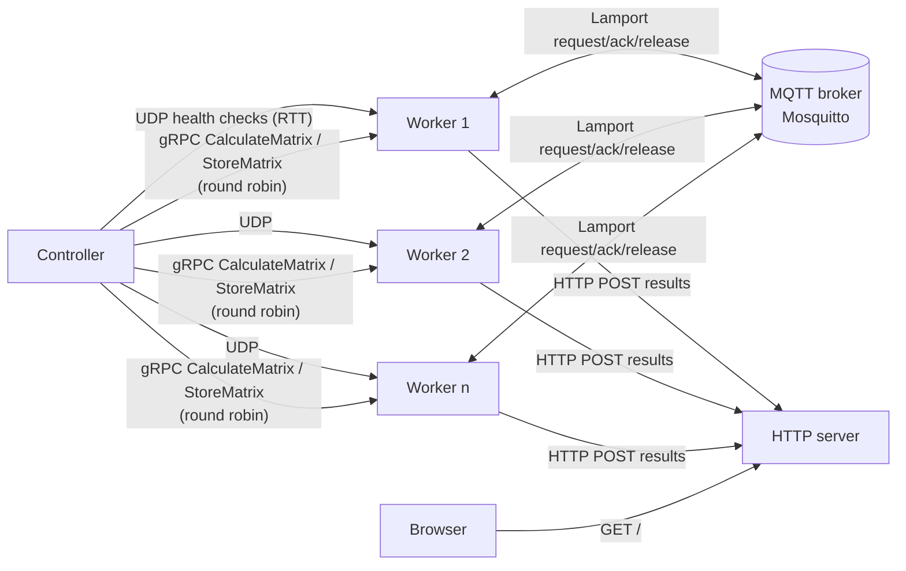
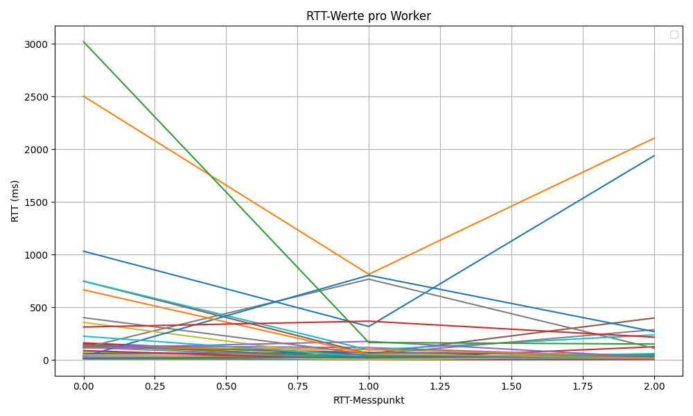

# Distributed Matrix Multiplication (gRPC · MQTT · UDP · Docker)

A containerised distributed system that splits a matrix multiplication across a
scalable pool of workers. It combines four communication mechanisms, each chosen
for a specific job:

| Mechanism | Used for |
|-----------|----------|
| **UDP** | Lightweight health checks and round-trip-time (RTT) measurement |
| **gRPC** (Protocol Buffers) | Remote procedure calls for computing and storing matrix cells |
| **MQTT** (Mosquitto) | Lamport mutual exclusion between workers (request / ack / release) |
| **HTTP over raw TCP** | A minimal hand-written HTTP server that collects and serves the result |

> Team project from the *Distributed Systems* course at Hochschule Darmstadt (WiSe 2024/25).

## Architecture



1. The **controller** discovers the workers, sends parallel UDP health checks and
   records the RTT of each worker.
2. The multiplication is split into one task per result cell. Tasks are
   distributed **round robin** to healthy workers through **gRPC**, in parallel
   (`ThreadPoolExecutor`). Unreachable workers are skipped.
3. Before writing a result, a worker enters a **critical section** coordinated
   with the **Lamport algorithm** over MQTT topics `worker/request`,
   `worker/ack` and `worker/release`.
4. Results are sent to the **HTTP server**, which assembles the final matrix
   and serves it on `http://localhost:8080`.

## Tech stack

Python 3 · gRPC / Protocol Buffers · paho-mqtt · Eclipse Mosquitto ·
Docker · Docker Compose (horizontal scaling with `--scale`, DNS round robin) · Make

## Getting started

Requirements: Docker with Docker Compose, and `make` (optional).

```bash
# build the images
make start

# start broker, HTTP server, controller and 3 workers
make up workers=3

# scale the worker pool at runtime
make scale workers=5

# stop everything
make down
```

Without `make`:

```bash
export WORKER_COUNT=3
docker compose build
docker compose up -d --scale worker=$WORKER_COUNT
```

Then open <http://localhost:8080> to see the result matrix.

## Repository layout

| Path | Purpose |
|------|---------|
| `controller.py` | Health checks, task splitting and round-robin distribution via gRPC |
| `worker.py` | gRPC server, UDP responder, Lamport mutual exclusion over MQTT |
| `http_server.py` | Minimal HTTP/1.1 server on raw sockets that stores and renders results |
| `matrix.proto` | gRPC service definition (`CalculateMatrix`, `StoreMatrix`) |
| `docker-compose.yml` | Broker, workers (scalable), controller and HTTP server |
| `statistik.py`, `rtt_statistik.png` | RTT analysis of the health checks |

## RTT measurements



## What I learned

- Choosing the right protocol per concern (UDP vs. gRPC vs. pub/sub)
- Service discovery and horizontal scaling of containers with Docker Compose
- Logical clocks and distributed mutual exclusion (Lamport)
- Measuring and analysing network latency in a containerised system
